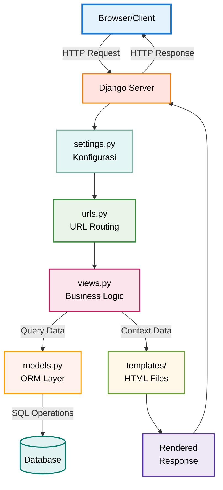
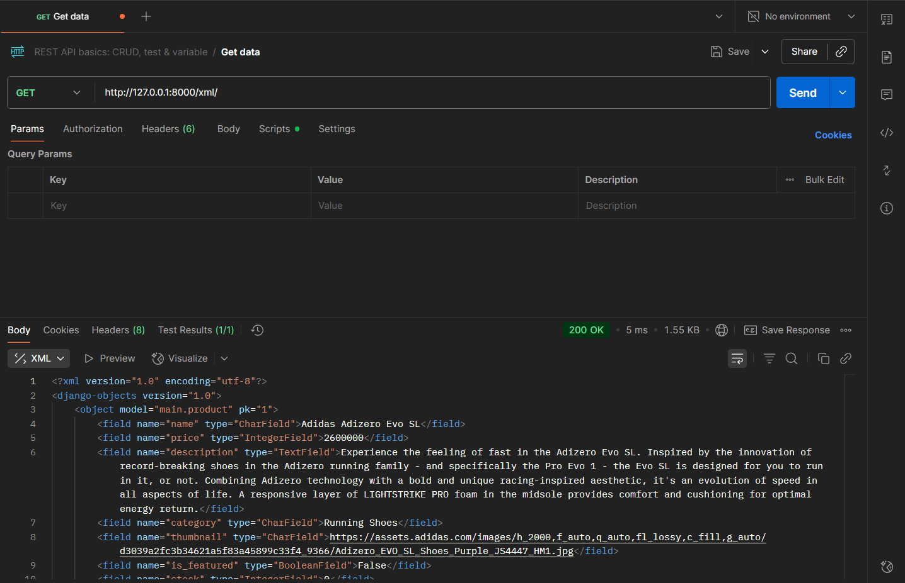
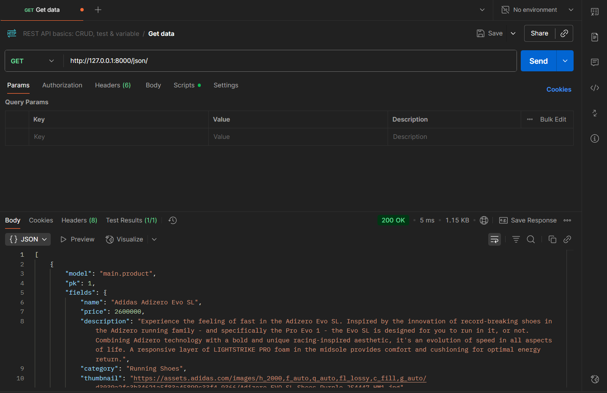
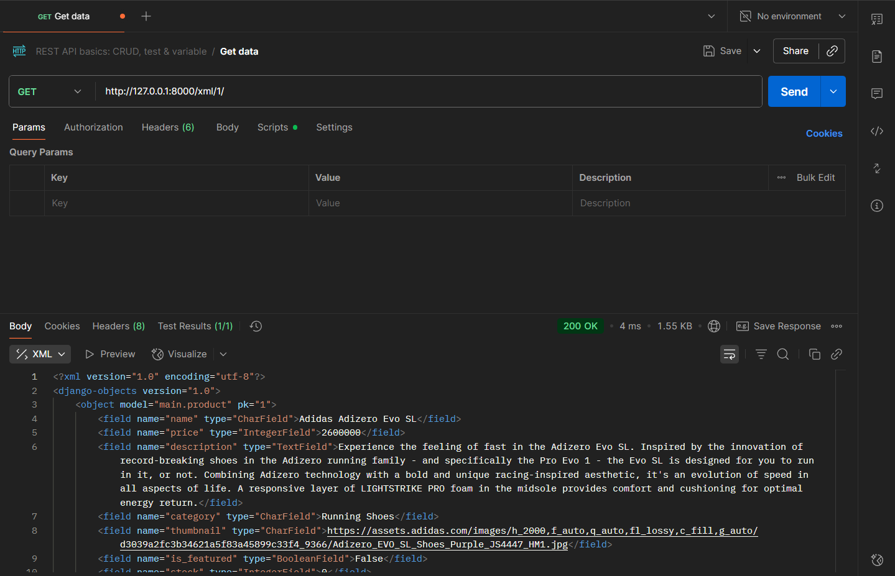
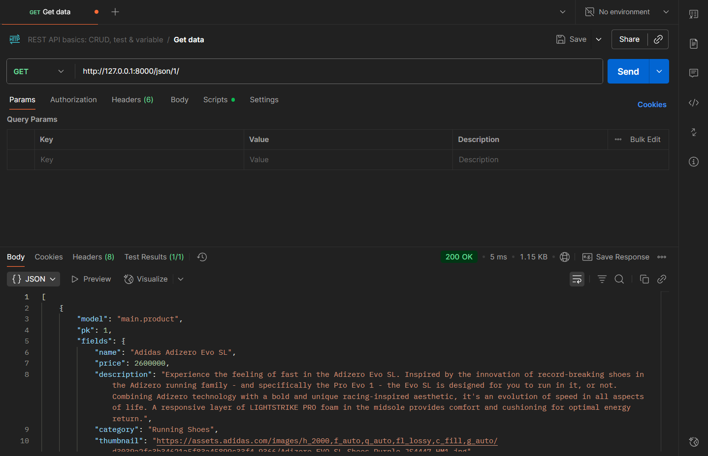

# Proyek PlayMax - Tugas 2 Pemrograman Berbasis Platform

Ini adalah implementasi proyek untuk Tugas 2, sebuah toko sepatu online bernama PlayMax.

**Nama**: Muhammad Alfa Mubarok
**NPM**: 2406431391
**Kelas**: PBP D

---

# Tautan Aplikasi PWS

Aplikasi dapat diakses melalui tautan berikut:
[https://muhammad-alfa41-playmax.pbp.cs.ui.ac.id/](https://muhammad-alfa41-playmax.pbp.cs.ui.ac.id/)

---

# Jawaban Pertanyaan

### 1. Jelaskan implementasi *checklist* tugas secara *step-by-step*.

Proyek `PlayMax` diimplementasikan dengan mengikuti alur arsitektur MVT pada Django:

1. **Inisialisasi Proyek dan Aplikasi**: Proyek `playmax` diinisialisasi menggunakan `django-admin startproject playmax`. Setelah itu, sebuah aplikasi `main` dibuat di dalamnya dengan `python manage.py startapp main` dan didaftarkan ke dalam `INSTALLED_APPS` di `playmax/settings.py`.

2. **Definisi Model**: Sesuai spesifikasi tugas, model `Product` dibuat di `main/models.py`. Model ini mendefinisikan struktur data produk dengan atribut wajib seperti `name` (CharField), `price` (IntegerField), `description` (TextField), dan lainnya.

3. **Migrasi Database**: Setelah model didefinisikan, perintah `python manage.py makemigrations` dijalankan untuk membuat skrip migrasi, diikuti `python manage.py migrate` untuk menerapkan skema model tersebut ke dalam database SQLite lokal.

4. **Pembuatan View dan Template**: Sebuah fungsi `show_main` dibuat di `main/views.py`. Fungsi ini bertindak sebagai lapisan **View (business logic)**. Awalnya, ia hanya mengirimkan *context* berisi data statis (nama, kelas, nama aplikasi) ke template. Template `main.html` kemudian dibuat sebagai lapisan **Template (presentation)** untuk menampilkan data dari *context* tersebut menggunakan *template tags* `{{ ... }}`.

5. **Konfigurasi Routing**: `main/urls.py` dibuat untuk memetakan URL root (`''`) ke fungsi `show_main`. Kemudian, `playmax/urls.py` (level proyek) dikonfigurasi untuk `include` semua URL dari aplikasi `main`, bertindak sebagai pintu gerbang utama untuk *request* yang masuk.

6. **Populasi Data**: Data produk pertama (sepatu Adidas Adizero) dimasukkan ke database melalui **Django Admin**. Ini dilakukan dengan membuat `superuser` via `python manage.py createsuperuser`, mendaftarkan model `Product` di `main/admin.py`, dan menginput data melalui antarmuka web di `/admin`.

7.  **Menampilkan Data Dinamis**: `main/views.py` diperbarui untuk mengambil semua objek produk dari database menggunakan `Product.objects.all()` dan menambahkannya ke *context*. `main.html` juga diperbarui dengan *loop* `` untuk menampilkan setiap data produk secara dinamis.

8.  **Deployment**: Semua perubahan kode di-*push* ke repositori PWS. Karena database produksi terpisah, `superuser` baru dibuat di server PWS melalui *console*, dan data produk dimasukkan kembali melalui halaman admin situs yang sudah *live*.

### 2. Bagan *request-response* dan kaitan MVT.
## Bagan 

Alur *request-response* pada Django mengikuti arsitektur Model-View-Template (MVT) yang memisahkan antara data, logika, dan tampilan.

Berikut penjelasannya berdasarkan bagan di atas:
1. **HTTP Request**: Pengguna mengakses sebuah URL, mengirimkan sebuah HTTP Request ke server.
2. **urls.py (Router)**: Django menerima *request* dan meneruskannya ke `urls.py`. Berkas ini bertindak seperti "peta jalan" yang mencocokkan pola URL dengan *view* yang sesuai untuk menanganinya.
3. **views.py (Business Logic Layer)**: Setelah menemukan kecocokan, `urls.py` akan memanggil fungsi yang sesuai di `views.py`. *View* adalah lapisan logika bisnis yang memproses *request*.
4. **models.py (Data Access Layer)**: Jika *view* membutuhkan data dari database (misalnya, daftar produk), ia akan berinteraksi dengan `models.py`. Model adalah lapisan akses data yang bertanggung jawab untuk membaca atau menulis data ke database.
5. **Template (Presentation Layer)**: Setelah *view* selesai memproses logika dan mendapatkan data dari model, ia akan meneruskan data tersebut ke sebuah *template* HTML.
6.  **HTTP Response (HTML)**: *Template engine* Django akan me-*render* berkas HTML, mengisi semua variabel dinamis (seperti `{{ product.name }}`) dengan data yang diterima dari *view*. Hasil akhirnya adalah sebuah halaman HTML utuh yang dikirim kembali ke browser pengguna sebagai HTTP Response.

### 3. Peran `settings.py` dalam proyek Django.

`settings.py` adalah file konfigurasi pusat untuk sebuah proyek Django. File ini berisi semua pengaturan penting yang menentukan bagaimana proyek berjalan, termasuk:
* **Konfigurasi Database**: Pengaturan untuk menghubungkan proyek dengan database (misalnya, SQLite, PostgreSQL).
* **Aplikasi Terinstal (`INSTALLED_APPS`)**: Daftar semua aplikasi yang aktif di dalam proyek, baik aplikasi bawaan Django maupun yang kita buat sendiri.
* **Konfigurasi Template**: Lokasi direktori tempat Django harus mencari file-file template HTML.
* **Secret Key**: Kunci unik untuk keamanan kriptografis.
* **Pengaturan Statis**: Konfigurasi untuk file statis seperti CSS dan JavaScript.
* **Middleware**: Daftar komponen yang memproses *request* dan *response* secara global.

Singkatnya, `settings.py` adalah "otak" dari konfigurasi proyek yang mengatur semua komponen untuk bekerja bersama.

### 4. Cara kerja migrasi database di Django.

Migrasi database di Django adalah proses dua langkah untuk menyinkronkan perubahan pada `models.py` dengan skema database yang sebenarnya.

1.  **`python manage.py makemigrations`**: Perintah ini akan membandingkan model Anda saat ini dengan versi terakhir yang disimpan dalam file migrasi. Jika ada perubahan (seperti menambah *field* atau model baru), Django akan membuat sebuah file Python baru di dalam folder `migrations/`. File ini berisi instruksi spesifik tentang bagaimana cara mengubah struktur database agar sesuai dengan model yang baru. Proses ini seperti membuat "cetak biru" atau *blueprint* perubahan.

2.  **`python manage.py migrate`**: Perintah ini membaca semua file "cetak biru" dari `makemigrations` yang belum diterapkan, lalu menerjemahkannya menjadi perintah SQL dan menjalankannya pada database. Proses inilah yang secara nyata mengubah struktur tabel di database, seperti membuat tabel baru atau menambahkan kolom.

Pemisahan ini memungkinkan developer untuk meninjau perubahan skema (cetak birunya) sebelum benar-benar menerapkannya ke database.

### 5. Mengapa Django dijadikan permulaan pembelajaran?

Menurut saya, Django adalah pilihan yang sangat baik untuk memulai pembelajaran pengembangan perangkat lunak karena beberapa alasan kuat:

* **Struktur yang Jelas (MVT)**: Arsitektur Model-View-Template memaksa pemula untuk mempraktikkan *Separation of Concerns*, yaitu memisahkan logika data (Model), logika bisnis (View), dan tampilan (Template). Ini membangun kebiasaan pengkodean yang baik dan terorganisir sejak awal.
* **"Batteries-Included" Philosophy**: Django hadir dengan banyak fitur bawaan yang sangat kuat, seperti ORM (Object-Relational Mapping) untuk berinteraksi dengan database tanpa perlu menulis SQL mentah, dan situs admin yang dibuat secara otomatis. Ini memungkinkan pemula untuk membuat aplikasi yang fungsional dengan cepat dan fokus pada logika aplikasi daripada membangun semuanya dari nol.
* **Keamanan Bawaan**: Django menangani banyak masalah keamanan umum (seperti SQL injection, XSS, CSRF) secara default, sehingga pemula dapat membangun aplikasi yang relatif aman tanpa harus menjadi ahli keamanan terlebih dahulu.
* **Ekosistem dan Dokumentasi yang Matang**: Django memiliki salah satu dokumentasi terbaik di dunia *open-source* dan didukung oleh komunitas yang besar. Ini memudahkan pemula untuk menemukan solusi, tutorial, dan bantuan saat menghadapi masalah.

### 6. Feedback untuk asisten dosen tutorial 1.

Untuk Feedback tersendiri saya cukup senang dengan kinerja para kakak-kakak asdos yang dimana sangat mau membantu adik tingkatnya yang mungkin kesusahan dalam memahami cara kerja Django, terima kasih kakak-kakak asdos dan semangat juga kuliahnya!

---

# Proyek PlayMax - Tugas 3 Pemrograman Berbasis Platform

Ini adalah implementasi proyek untuk Tugas 3, sebuah toko sepatu online bernama PlayMax, yang kini dilengkapi dengan fitur form dan data delivery (XML/JSON).

**Nama**: Muhammad Alfa Mubarok
**NPM**: 2406431391
**Kelas**: PBP D

---

# Tautan Aplikasi PWS

Aplikasi dapat diakses melalui tautan berikut:
[https://muhammad-alfa41-playmax.pbp.cs.ui.ac.id/](https://muhammad-alfa41-playmax.pbp.cs.ui.ac.id/)

---

# Jawaban Pertanyaan Tugas 3

### 1. Mengapa kita memerlukan data delivery dalam pengimplementasian sebuah platform?

Kita memerlukan **data delivery** karena platform modern seringkali terdiri dari berbagai komponen atau *stack* yang terpisah (misalnya, backend dan frontend) yang perlu berkomunikasi satu sama lain.  Data delivery berfungsi sebagai jembatan yang memungkinkan pengiriman dan pertukaran data antar komponen tersebut.

Sebagai contoh, backend (server) perlu mengirimkan data ke frontend (browser) untuk ditampilkan kepada pengguna. Format data seperti **HTML**, **XML**, atau **JSON** digunakan untuk membungkus data agar terstruktur dan dapat dibaca oleh komponen yang menerimanya. Tanpa mekanisme data delivery yang standar, integrasi antar sistem menjadi sangat sulit dan tidak efisien.

### 2. Menurutmu, mana yang lebih baik antara XML dan JSON? Mengapa JSON lebih populer dibandingkan XML?

Untuk sebagian besar aplikasi web modern, **JSON dianggap lebih baik** dan lebih populer karena beberapa alasan:

* **Lebih Ringkas dan Cepat**: JSON memiliki sintaks yang lebih sedikit (*less verbose*) dibandingkan XML. JSON tidak memerlukan tag penutup, sehingga ukuran datanya lebih kecil dan lebih cepat untuk diproses (di-*parsing*).
* **Mudah Dibaca**: Struktur `key-value` pada JSON seringkali lebih mudah dibaca dan dipahami oleh manusia dibandingkan struktur tag pada XML.
* **Integrasi dengan JavaScript**: Sintaks JSON identik dengan cara membuat objek JavaScript. Hal ini membuatnya sangat mudah digunakan dalam pengembangan web, di mana JavaScript adalah bahasa dominan di sisi klien. Mengubah data JSON menjadi objek JavaScript hanya memerlukan satu baris fungsi, yaitu `JSON.parse()`.

Karena alasan-alasan inilah, terutama kemudahan dan efisiensinya dalam ekosistem web berbasis JavaScript, JSON menjadi jauh lebih populer daripada XML.

### 3. Jelaskan fungsi dari method `is_valid()` pada form Django dan mengapa kita membutuhkan method tersebut?

Fungsi `is_valid()` pada form Django adalah sebuah *method* yang bertugas untuk **menjalankan validasi data** yang dikirim oleh pengguna melalui form. Method ini akan memeriksa apakah data yang diinput sesuai dengan aturan yang telah didefinisikan pada model atau form (misalnya, tipe data, panjang maksimal, apakah wajib diisi, dll.).

Kita sangat membutuhkan `is_valid()` karena:
1.  **Keamanan**: Mencegah data yang tidak valid atau berbahaya masuk ke dalam database.
2.  **Integritas Data**: Memastikan data yang tersimpan di database bersih, konsisten, dan sesuai dengan skema yang diharapkan.
3.  **User Experience**: Memberikan umpan balik yang jelas kepada pengguna jika ada kesalahan input, sehingga mereka bisa memperbaikinya.

Dalam kode, data hanya akan disimpan (`form.save()`) jika `is_valid()` mengembalikan nilai `True`, yang berarti semua data sudah lolos proses validasi.

### 4. Mengapa kita membutuhkan `csrf_token` saat membuat form di Django? Apa yang dapat terjadi jika kita tidak menambahkannya?

`` adalah *template tag* Django yang berfungsi untuk **mencegah serangan Cross-Site Request Forgery (CSRF)**. CSRF adalah jenis serangan di mana situs web jahat menipu browser pengguna untuk melakukan permintaan (misalnya, mengirimkan data form) ke situs web lain tempat pengguna sedang login, tanpa sepengetahuan pengguna.

**Apa yang terjadi jika tidak ada `csrf_token`?**
Jika kita tidak menyertakan `csrf_token`, aplikasi kita menjadi rentan terhadap serangan CSRF. Penyerang dapat membuat halaman web palsu yang berisi form tersembunyi. Form ini akan otomatis mengirimkan data ke aplikasi kita (misalnya, menghapus data atau mengubah password) saat pengguna yang sedang login di aplikasi kita mengunjungi halaman palsu tersebut. Karena permintaan datang dari browser pengguna, server akan menganggapnya sebagai permintaan yang sah.

`csrf_token` mencegah ini dengan cara menghasilkan sebuah token unik di sisi server untuk setiap sesi pengguna dan menyisipkannya di dalam form. Ketika form dikirim, Django akan memverifikasi apakah token yang dikirim kembali oleh browser cocok dengan yang ada di server. Jika tidak, permintaan akan ditolak.

### 5. Jelaskan bagaimana cara kamu mengimplementasikan checklist di atas secara step-by-step.

Berikut adalah langkah-langkah implementasi yang saya lakukan untuk Tugas 3:

1. **Membuat Form**: Pertama, saya membuat file `main/forms.py` dan mendefinisikan `ProductForm` menggunakan `ModelForm` untuk terhubung langsung dengan model `Product`. Saya tentukan *field-field* yang akan ditampilkan di form.
2. **Membuat Views untuk Form dan Data Display**: Di `main/views.py`, saya membuat fungsi `create_product` untuk menangani logika form. Selain itu, saya memperbarui `show_main` untuk mengambil semua objek produk dari database (`Product.objects.all()`) dan mengirimkannya ke template.
3. **Membuat Template Form dan Memperbarui Halaman Utama**: Saya membuat file `main/templates/create_product.html` untuk halaman form. Kemudian, saya memodifikasi `main.html` untuk menampilkan semua produk dalam bentuk kartu dan menambahkan tombol "Add New Product" yang mengarah ke halaman form.
4. **Membuat Data Delivery Endpoints (XML & JSON)**: Di `views.py`, saya menambahkan empat fungsi: `show_xml` dan `show_json` untuk semua data, serta `show_xml_by_id` dan `show_json_by_id` untuk data spesifik. Fungsi-fungsi ini menggunakan `serializers.serialize()` dari Django untuk mengubah *queryset* model menjadi format XML atau JSON dan mengembalikannya sebagai `HttpResponse`.
5. **Menambahkan URL Routing**: Terakhir, saya mendaftarkan semua path URL untuk setiap view yang telah dibuat di `main/urls.py`, memberikan nama untuk setiap path agar mudah dipanggil dari template.

### Screenshot Akses URL Menggunakan Postman

**Contoh Akses `http://127.0.0.1:8000/xml/`:**
[Contoh XML](

**Contoh Akses `http://127.0.0.1:8000/json/`:**
[Contoh JSON]()

**Contoh Akses `http://127.0.0.1:8000/xml/1/`:**
[Contoh XML by ID]()

**Contoh Akses `http://127.0.0.1:8000/json/1/`:**
[Contoh JSON by ID]()

### Feedback untuk Asisten Dosen Tutorial 2

Untuk Feedback tersendiri saya sangat senang dengan kinerja para kakak-kakak asdos yang dimana mau membantu adik tingkatnya yang mungkin kesusahan dalam memahami cara kerja Django dan juga mungkin mau ditanya-tanya beberapa hal diluar tugas yang menambah wawasan baru saya dalam perkuliahan, terima kasih kakak-kakak asdos dan semangat juga kuliahnya!

---

# Proyek PlayMax - Tugas 4 Pemrograman Berbasis Platform

Ini adalah implementasi proyek untuk Tugas 4, yang kini dilengkapi dengan fitur autentikasi, session, dan cookies.

**Nama**: Muhammad Alfa Mubarok
**NPM**: 2406431391
**Kelas**: PBP D

---

# Tautan Aplikasi PWS

Aplikasi dapat diakses melalui tautan berikut:
[https://muhammad-alfa41-playmax.pbp.cs.ui.ac.id/](https://muhammad-alfa41-playmax.pbp.cs.ui.ac.id/)

---
# Jawaban Pertanyaan Tugas 4

### 1. Apa itu Django Authentication Form? Jelaskan juga kelebihan dan kekurangannya.

**Django Authentication Form** adalah sebuah *form* bawaan dari Django (`django.contrib.auth.forms.AuthenticationForm`) yang dirancang khusus untuk menangani proses login pengguna. *Form* ini secara otomatis menyediakan *field* untuk `username` dan `password` serta logika validasi di belakangnya.

* **Kelebihan:**
    * **Cepat dan Mudah:** Menghemat waktu pengembangan karena tidak perlu membuat *form* dan logika validasi dari nol.
    * **Aman:** Sudah dilengkapi dengan mekanisme keamanan bawaan Django untuk memeriksa kredensial pengguna, seperti validasi *password hash*.
    * **Terintegrasi:** Terhubung langsung dengan sistem autentikasi Django, sehingga proses *login* dan pembuatan *session* menjadi sangat mudah.

* **Kekurangan:**
    * **Kurang Fleksibel:** Tampilannya cukup standar. Jika ingin kustomisasi lebih lanjut (misalnya, login dengan email atau menambah *field* lain), diperlukan upaya lebih untuk membuat *form* turunan.
    * **Pesan Error Standar:** Pesan error yang ditampilkan bersifat umum (misalnya, "Please enter a correct username and password"), yang meskipun baik untuk keamanan, mungkin kurang informatif bagi pengguna.

### 2. Apa perbedaan antara autentikasi dan otorisasi? Bagaimana Django mengimplementasikan kedua konsep tersebut?

* **Autentikasi** adalah proses **memverifikasi identitas** seseorang; menjawab pertanyaan "Siapa Anda?". Ini biasanya dilakukan melalui proses *login*.

* **Otorisasi** adalah proses **memverifikasi hak akses** seseorang; menjawab pertanyaan "Apa yang boleh Anda lakukan?". Proses ini terjadi setelah autentikasi berhasil dan menentukan sumber daya mana yang boleh diakses oleh pengguna.

**Implementasi di Django:**
* **Autentikasi:** Django mengimplementasikannya melalui `django.contrib.auth`. Fitur-fitur seperti model `User`, *form* (`AuthenticationForm`, `UserCreationForm`), dan fungsi (`authenticate`, `login`, `logout`) digunakan untuk mengelola proses verifikasi identitas pengguna.

* **Otorisasi:** Django menangani otorisasi melalui beberapa cara, di antaranya:
    * ***Decorator* `@login_required`:** Cara paling sederhana untuk memastikan hanya pengguna yang sudah terautentikasi yang bisa mengakses sebuah *view* atau halaman.
    * ***Permission System*:** Django memiliki sistem izin (*permission*) yang bisa dikaitkan dengan model, memungkinkan kita memeriksa apakah seorang pengguna memiliki izin spesifik.
    * ***User Groups*:** Pengguna bisa dikelompokkan ke dalam grup, dan izin bisa diberikan pada level grup untuk menyederhanakan manajemen hak akses.

### 3. Apa saja kelebihan dan kekurangan session dan cookies dalam konteks menyimpan state di aplikasi web?

Karena HTTP adalah protokol yang *stateless* (tidak menyimpan informasi dari *request* sebelumnya), *session* dan *cookies* digunakan untuk "mengingat" pengguna di antara berbagai *request*.

**Cookies:**
* **Kelebihan:**
    * **Sederhana:** Mudah diimplementasikan untuk menyimpan data kecil langsung di *browser* pengguna.
    * ***Persistent*:** Bisa diatur agar tetap ada bahkan setelah *browser* ditutup, cocok untuk fitur seperti "Ingat Saya".
* **Kekurangan:**
    * **Tidak Aman:** Data disimpan di sisi klien dalam bentuk teks, sehingga tidak cocok untuk menyimpan informasi sensitif.
    * **Kapasitas Terbatas:** Ukuran *cookies* sangat kecil, biasanya hanya sekitar 4 KB.

***Session*:**
* **Kelebihan:**
    * **Aman:** Data disimpan di sisi server. Yang dikirim ke klien hanyalah sebuah ID *session* acak yang disimpan dalam *cookie*. Ini jauh lebih aman untuk data sensitif.
    * **Kapasitas Lebih Besar:** Karena data ada di server, kapasitas penyimpanannya jauh lebih besar daripada *cookies*.
* **Kekurangan:**
    * **Membebani Server:** Setiap *session* aktif akan memakan memori atau ruang penyimpanan di server. Jika jumlah pengguna sangat banyak, ini bisa menjadi masalah skalabilitas.
    * ***Non-persistent* (Default):** Secara *default*, *session* akan berakhir saat *browser* ditutup.

### 4. Apakah penggunaan cookies aman secara default, atau ada risiko yang harus diwaspadai? Bagaimana Django menangani hal tersebut?

Penggunaan *cookies* **tidak aman secara *default***. Karena disimpan di sisi klien, *cookies* rentan terhadap beberapa risiko:

* ***Cross-Site Scripting (XSS):*** *Attacker* bisa menyuntikkan skrip jahat ke dalam sebuah situs untuk mencuri data *cookie* pengguna, termasuk *session ID*.
* ***Cross-Site Request Forgery (CSRF):*** *Attacker* bisa menipu *browser* pengguna untuk melakukan tindakan yang tidak diinginkan di sebuah situs tempat pengguna sedang login, dengan memanfaatkan *cookie* sesi yang aktif.

**Bagaimana Django menanganinya:**
Django menyediakan beberapa lapisan keamanan bawaan untuk mitigasi risiko ini:
* **Proteksi CSRF:** Django mewajibkan penggunaan `` di dalam setiap *form* POST. Token ini memastikan bahwa *request* yang dikirim berasal dari situs yang sah, bukan dari situs lain yang mencoba melakukan serangan CSRF.
* ***HttpOnly Cookies:*** Secara *default*, *cookie* sesi (`sessionid`) dan token CSRF (`csrftoken`) di Django diatur sebagai `HttpOnly`. Artinya, *cookie* ini tidak bisa diakses melalui JavaScript di *browser*, sehingga sangat efektif untuk mencegah pencurian *cookie* melalui serangan XSS.
* ***Escaping* Otomatis:** *Template engine* Django secara otomatis melakukan *escaping* pada variabel yang di-*render* ke HTML. Ini membantu mencegah sebagian besar serangan XSS dengan mengubah karakter berbahaya menjadi entitas HTML yang tidak bisa dieksekusi.

### 5. Jelaskan bagaimana cara kamu mengimplementasikan checklist di atas secara step-by-step.

Berikut adalah langkah-langkah implementasi yang saya lakukan untuk Tugas 4:

1.  **Implementasi Autentikasi**: Saya menambahkan fungsi `register`, `login_user`, dan `logout_user` ke `main/views.py` menggunakan `UserCreationForm` dan `AuthenticationForm` bawaan Django. Saya juga membuat template `register.html` dan `login.html` untuk menampilkan form, serta mendaftarkan URL-nya di `main/urls.py`.
2.  **Membatasi Akses**: Saya menggunakan *decorator* `@login_required(login_url='/login/')` pada fungsi-fungsi *view* yang halamannya ingin saya proteksi, seperti `show_main` dan `create_product`.
3.  **Menghubungkan Model `Product` dengan `User`**: Di `main/models.py`, saya menambahkan *field* `user = models.ForeignKey(User, on_delete=models.CASCADE)` untuk menciptakan relasi *many-to-one*. Setelah itu, saya menjalankan `makemigrations` dan `migrate` untuk memperbarui skema database.
4.  **Menyimpan Produk Milik User**: Saya memodifikasi fungsi `create_product` di `views.py`. Saya menggunakan `form.save(commit=False)` untuk menahan objek sebelum disimpan, lalu mengatur `product.user = request.user` untuk menetapkan pemilik produk, baru kemudian menyimpannya dengan `product.save()`.
5.  **Menampilkan Data Sesuai User**: Di `views.py`, saya mengubah *query* di `show_main` menjadi `Product.objects.filter(user=request.user)` agar hanya menampilkan produk yang dimiliki oleh pengguna yang sedang login.
6.  **Implementasi Cookies**: Saya memodifikasi fungsi `login_user` untuk `response.set_cookie('last_login', ...)` dan `logout_user` untuk `response.delete_cookie('last_login')`. Di `show_main`, saya mengambil nilai *cookie* dengan `request.COOKIES.get('last_login', ...)` dan menampilkannya di template `main.html`.
7.  **Membuat Data Dummy**: Terakhir, saya membuat dua akun pengguna melalui halaman registrasi, lalu login dengan masing-masing akun untuk menambahkan tiga data produk yang berbeda, memastikan setiap akun hanya bisa melihat datanya sendiri.

---